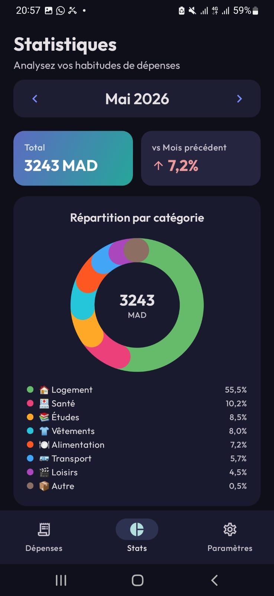
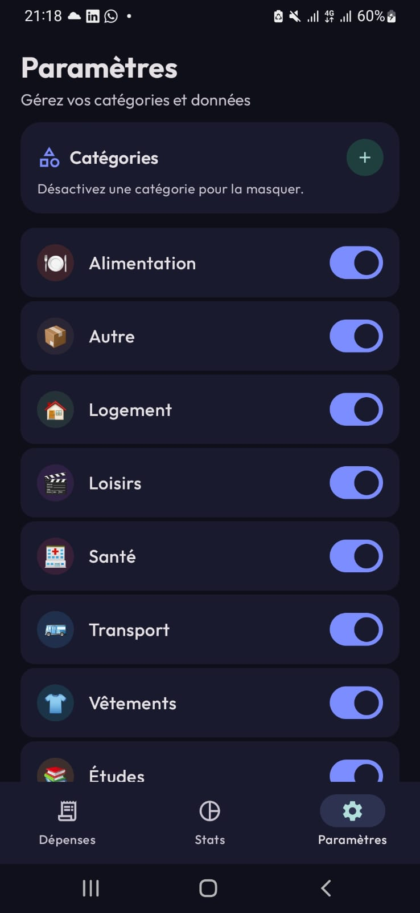
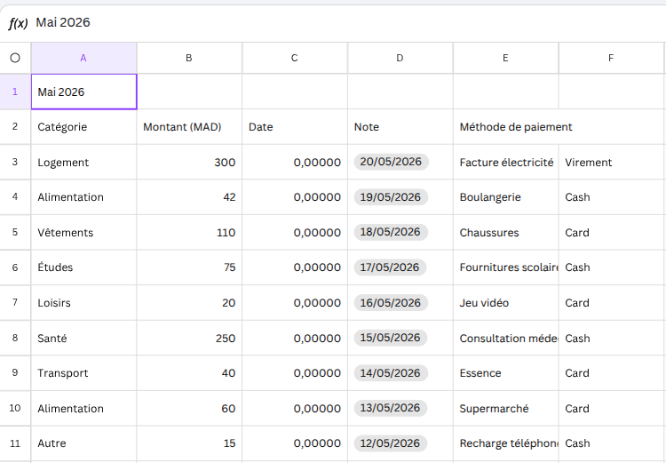

# SmartBudget 💰

SmartBudget est une application Android moderne de gestion de budget personnel, conçue avec une approche **offline-first**. Elle permet de suivre ses dépenses, de définir des limites budgétaires par catégorie et d'analyser ses habitudes financières via des statistiques visuelles élégantes.

## 🚀 Fonctionnalités

- **Gestion des Dépenses (CRUD)** : Ajoutez, modifiez et supprimez vos transactions en quelques secondes.
- **Catégorisation intelligente** : Organisez vos dépenses (Alimentation, Transport, Logement, etc.).
- **Budgets Mensuels** : Définissez des plafonds par catégorie pour garder le contrôle sur vos finances.
- **Statistiques Visuelles** : Visualisez la répartition de vos dépenses via un Donut Chart animé.
- **Offline-First** : Fonctionne entièrement sans connexion internet grâce à Room Database.
- **Import/Export CSV** : Exportez vos données vers votre stockage ou partagez-les via vos applications préférées.
- **Design Premium** : Interface moderne basée sur Material 3 avec thèmes sombres et typographie soignée (Outfit).

## 📸 Aperçu de l'application

| Statistiques | Ajout de Dépense | Budgets par Catégorie |
|:---:|:---:|:---:|
|  |  |  |

| Gestion Catégories | Export/Import CSV | Budgets Mensuels |
|:---:|:---:|:---:|
|  |  |  |

## 🛠️ Stack Technique

- **Langage** : [Kotlin](https://kotlinlang.org/)
- **UI** : [Jetpack Compose](https://developer.android.com/jetpack/compose) (Material 3)
- **Base de données** : [Room](https://developer.android.com/training/data-storage/room)
- **Architecture** : MVVM (Model-View-ViewModel)
- **Injection de dépendances** : [Hilt](https://developer.android.com/training/dependency-injection/hilt-android)
- **Asynchronisme** : Coroutines & Flow

## 📂 Structure du projet

- `data/` : Entités Room, DAOs et configuration de la base de données.
- `di/` : Modules Hilt pour l'injection de dépendances.
- `repository/` : Couche d'abstraction des données.
- `ui/` : Écrans, thèmes et composants Jetpack Compose.
- `viewmodel/` : Logique métier et gestion de l'état de l'interface.

---
**Développé par Yahya AHMANE - 2026**
